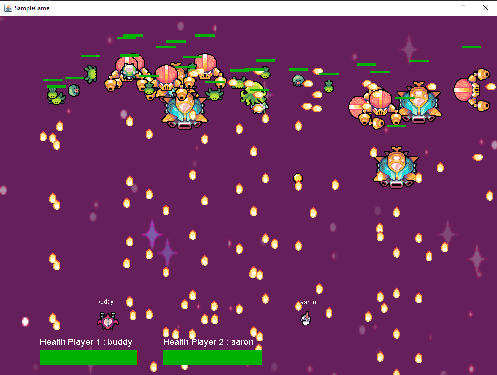

# shooter-dsl
A DSL to quickly prototype shooter games (a CPSC 410 project).

## Group members
1. Johnson Vu
2. Justin Kwan
3. Leon Lui
4. MengXin Zhao
5. Varun Belani

## Build and Run
```
git clone https://github.com/johnsonvu/shooter-dsl
cd shooter-dsl
javac @sources.txt
java -cp src/ ui.Main
```

## EBNF
```
PROGRAM ::= GAME_DEF OBJECT_MODIFIER* FUNCTION_DEC*

GAME_DEF ::= "make game" IDENTIFIER "{" "width = " NUMBER ", height = " NUMBER" "}" "{" (GAME_STATEMENT | VARDEC | VARSET)* "}"

OBJECT_MODIFIER ::= "set" IDENTIFIER "{" PROPERTY_STATEMENTS "}"

PROPERTY_STATEMENTS ::= PROPERTY_STATEMENT* ("behave = " IDENTIFIER)?

PROPERTY_STATEMENT  ::= PROPERTY "=" EXPR

STATEMENT :: = GAME_STATEMENT | BEHAVE_STATEMENT | PROPERTY_STATEMENT | VARDEC | VARSET | 

GAME_STATEMENT ::= MAKE_STATEMENT | IF_STATEMENT

MAKE_STATEMENT ::=  "make" EXPR? TYPE IDENTIFIER

BEHAVE_STATEMENT ::= MOVEMENT_STATEMENT | SHOOT_STATEMENT

MOVEMENT_STATEMENT ::= "move" EXPR DIRECTION

SHOOT_STATEMENT ::= "shoot" DIRECTION

FUNCTION_DEC ::= "define" IDENTIFIER "(" (PARAM,)* PARAM? ")" BLOCK

FUNCITON_CALL ::= "call" IDENTIFIER "(" (PARAM,)* PARAM? ")"

BLOCK ::= "{" STATEMENT* "}"

PROPERTY ::= "damage" | "health"

GAME_STATE ::= win | lose

TYPE ::= "player" | "projectile" | "enemy" | "item"

IDENTIFIER ::= [A-Z|a-z|0-9]+

NUMBER ::= [0-9]+

IF_STATEMENT ::= "if" "(" CONDITION ")" BLOCK

CONDITION ::= IDENTIFIER (">"| "<" | "=") IDENTIFIER

DIRECTION ::= UP | DOWN | LEFT | RIGHT

VARDEC ::= "new" IDENTIFIER

VARSET ::= IDENTIFIER "=" EXPR

EXPR ::= EXPR OP EXPR

EXPR ::= IDENTIFIER | NUMBER

OP ::= "+" | "-" | "/" | "*"

```

## Preview


## Controls
Default controls are assigned for up to 3 players
- Player 1 - **WASD** for Up, Left, Down, Right and **C** for Shoot
- Player 2 - **YGHJ** for Up, Left, Down, Right and **M** for Shoot
- Player 3 - **PL;'** for Up, Left, Down, Right and **Shift** for Shoot

## Credits
1. Game Architecture and design heavily inspired by derickfelix's WizardTDS: https://github.com/derickfelix/WizardTDS
2. Sprites and game visuals by Sparklin Labs: https://www.patreon.com/SparklinLabs


